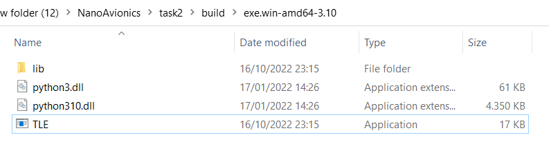
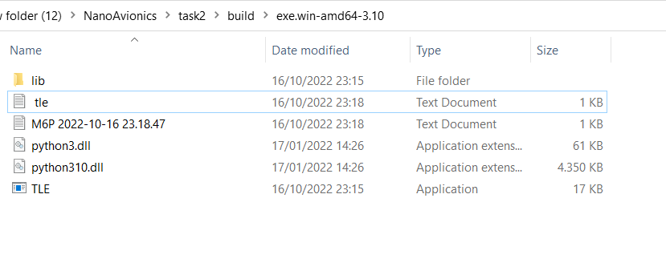
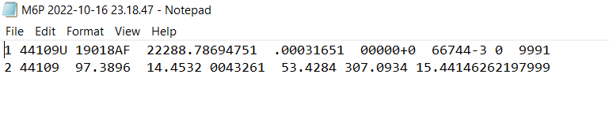

# TLE


### Task

TLE (https://en.wikipedia.org/wiki/Two-line_element_set) file is being used in our satellites as the main reference for ADCS
maneuvers (like ground station tracking) and it must be updated from ground periodically. One way to get TLE for a
satellite is to download it from Celestrak database (https://celestrak.com/NORAD/elements/active.txt).
Use any method to retrieve TLE list from Celestrak and convert it so only TLE for M6P satellite would be exported to a
separate text file by double clicking the shortcut of prepared solution or launching the script.

### About

TLEs are widely used as input for projecting the future orbital tracks of space debris for purposes of characterizing "future debris events to support risk analysis, close approach analysis, collision avoidance maneuvering" and forensic analysis.

### Installing

There are two way to get this program:

1. Just download .zip file and extract it:

https://www.mediafire.com/file/vxuu3upal34ima6/build.zip/file

2. Or just simply type it to your termnal:

```
git clone git@github.com:Alg1mantas/TLE_generator.git
```

and also don't forget to install libraries:

```
pip install -r requirements.txt
```

### Usage

In order to find .exe file just go to program files directory: build > exe.win-amd64-3.10

Press Aplication file (.exe) twice

After a few seconds in the same directory two new text and log files will apear



Double press on a file with satellite name : "M6P" . Here you will find all TLE data about satellite M6P.



If you want to run this program on terminal just simply write to your terminal:

```
py TLE.py
```

The output will be the same text files.
